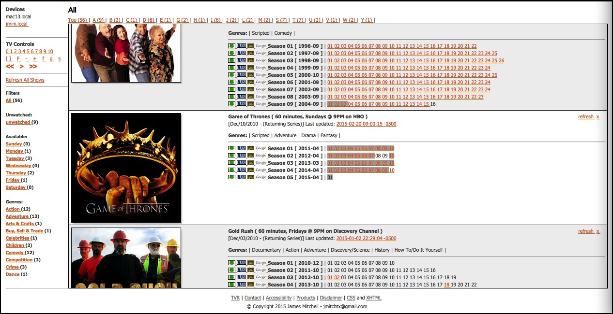

# TVR
A Sinatra based webapp for watching (like a TV) and managing (like a DVR) your favorite digital content.

## Disclaimer
*If you intend to use this application to manage illegally downloaded digital media ... you do so at your own risk.*

## Screenshots

## History
This application is an extraction of part of an exising rails application I wrote for myself in my 
spare time to help me manage the shows I like to watch.

##### Q. Why not just make an adapter/plugin/whatever for something like XBMC?
##### A. Because this just seemed easier to me.

## Documentation

Check out the [current progress](progress.md).

### Assumptions
 - this application runs system commands under whatever user permissions you run the app with
   - reading and renaming files
   - launching your media player
 - you can clone a git repository
 - you know how to bundle (in the sense of bundler)
 - you are not using Windows (currently only support for *nix, maybe cygwin .. I haven't tried it)
 - you have a video player (VLC, quicktime, etc)
 - if you use a remote media player, it supports ssh and has auth keys already copied
 - you have a compatible version of ruby installed (I prefer RVM)

### Installation
Check out from Github:

    $ git clone git@github.com:jmitchtx/tvr.git
    $ cd tvr
    $ bundle
    $ mkdir .shows
    $ find /path/to/my/mkvs       > .binaries/local-drive.txt
    $ find /Volumes/other/hd/mkvs > .binaries/other-drive.txt
    $ ruby tvr.rb

Open in your favorite browser: http://localhost:4567/

### How it works
You provide a file directory listing. I just have cron job that does:
    $ find /path/to/my/mkvs > /path/to/my/tvr/installation/.shows/
    
 that this application will parse and determine:
  - of the shows you want to see, which ones match the tv show name
  - 

#### Copyright
Copyright &copy; James Mitchell

This work is free. You can redistribute it and/or modify it under the
terms of the Do What The Fuck You Want To Public License, Version 2,
as published by Sam Hocevar. See the [COPYING](COPYING) file for more details.

